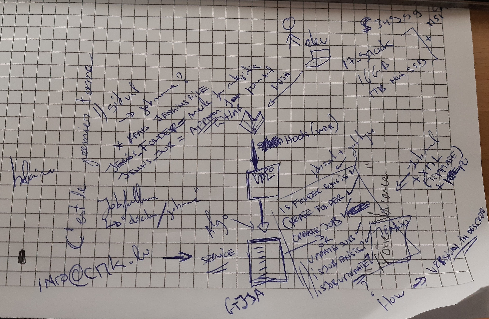

## gitlab system hook
- Repository Upadate events
- will use gitlab file raw dowload to check availibilitayy of Jenkins file

    https://gitlab.maduma.org/maduma/pompiste/-/raw/master/Jenkinsfile
    https://raw.githubusercontent.com/maduma/flutiste/master/Jenkinsfile

## make usre flask is running single threaded
- FLASK_APP=web.py flask run --without-threads

curl --header 'PRIVATE-TOKEN: Bkx51FNtNUdeVYFumnZn' 'https://gitlab.maduma.org/api/v4/projects/2/repository/files/Jenkinsfile/raw?ref=master'
